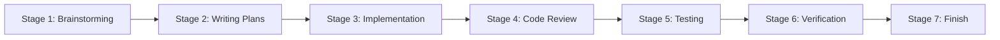
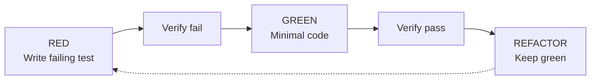
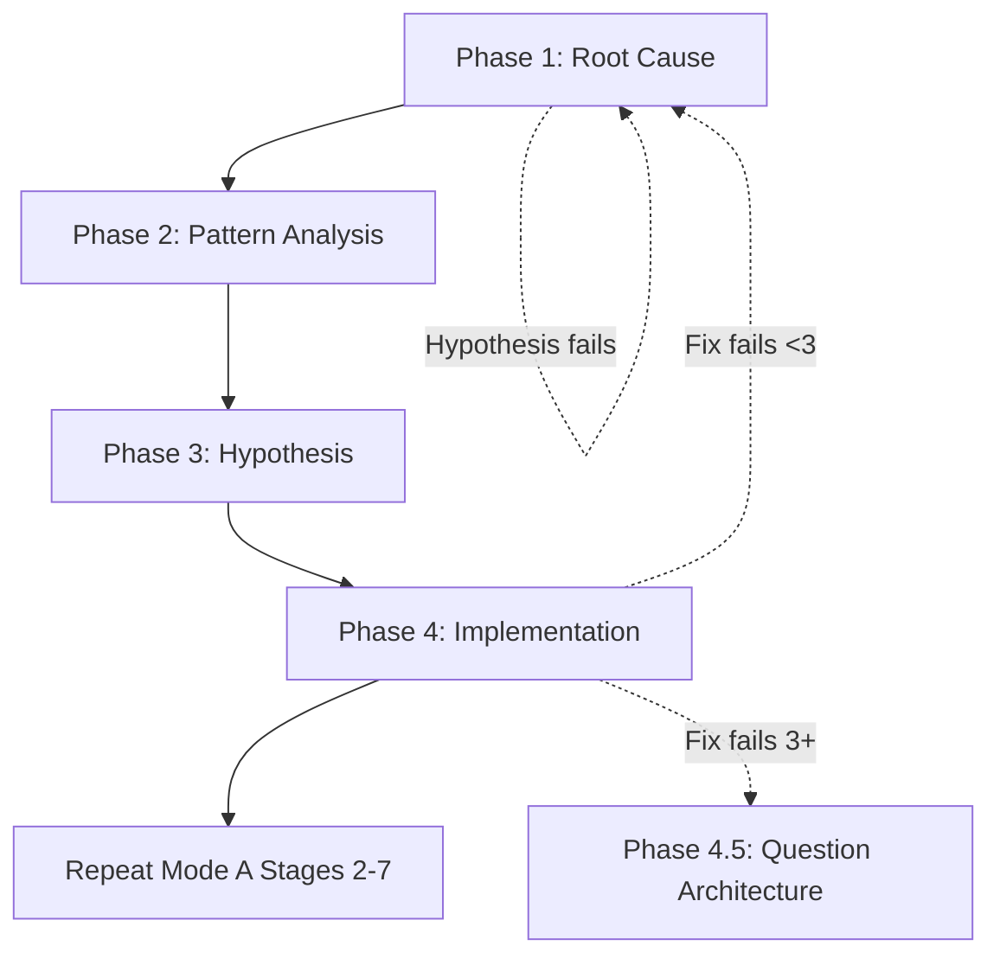

# Universal Development Workflow

> **Quick Links**: [Troubleshooting](WORKFLOW_TROUBLESHOOTING.md) | [Templates](WORKFLOW_TEMPLATES.md)  
> **Configuration**: See [CONFIGURATION.md](CONFIGURATION.md) to adapt for your stack

---

## Overview

This is a **technology-agnostic** adaptation of the Superpowers workflow. It maintains the **exact same skill structure** while allowing different technology stacks to plug in their specific commands and paths.

**Core principle**: The Superpowers skills (`brainstorming`, `writing-plans`, `test-driven-development`, etc.) remain unchanged. Only the **project-specific commands and paths** are configurable.

---

## Configuration

Before using this workflow, your project must define:

```yaml
# PROJECT_CONFIG.yaml (create this in your project root)

stack:
  name: "Your Stack Name"
  language: python|typescript|go|rust|...

commands:
  test: "your test command"
  build: "your build command"
  lint: "your lint command"

paths:
  design_docs: "docs/designs/"
  plans: "docs/plans/"
  tests:
    unit: "tests/unit/"
    integration: "tests/integration/"

constraints:
  - "Zero warnings"
  - "Zero mocks"

# Optional: per-stage customizations
stage_customizations:
  stage_5:
    test_commands:
      - "{test} {unit_test_path}"
      - "{test} {integration_test_path}"
```

See [CONFIGURATION.md](CONFIGURATION.md) for complete template.

---

## START HERE: 3 Questions

```yaml
Q1: Did you read "using-superpowers" skill?
   NO → Read it NOW before anything else
   YES → Continue to Q2

Q2: What type of work is this?
   Bug/Fix/Error → MODE B (Debug)
   Add/Create/Build → MODE A (Feature)
   Unclear → Ask user to clarify

Q3: Are you stuck?
   YES → Read [Troubleshooting](WORKFLOW_TROUBLESHOOTING.md)
   NO → Follow mode workflow below
```

---

## MODE A: Feature Development (7 Stages)

**Skills used**: `brainstorming` → `writing-plans` → `test-driven-development`/`subagent-driven-development` → `requesting-code-review` → *testing* → `verification-before-completion` → `finishing-a-development-branch`



### Stage 1: Brainstorming
**Skill**: `brainstorming` | **Output**: `{design_docs_path}/YYYY-MM-DD-<feature>-design.md`

**Now**: Explore context → Ask questions → Propose 2-3 approaches → Get user approval → Write design doc

1. Read `brainstorming` skill
2. Explore project context
3. Ask clarifying questions ONE AT A TIME
4. Propose 2-3 approaches with trade-offs
5. Present design for user approval
6. Write design doc to configured path
7. Self-review (no TBD/TODO)
8. **GATE**: User must approve before proceeding

---

### Stage 2: Writing Plans
**Skill**: `writing-plans` | **Output**: `{plans_path}/YYYY-MM-DD-<feature>-plan.md`

**Now**: Check scope → Design file structure → Decompose into 2-5 min tasks → Write plan

1. Read `writing-plans` skill
2. Check scope (break into separate plans if needed)
3. Design file structure
4. Decompose into bite-sized tasks
5. Write plan with exact file paths and code
6. Self-review (spec coverage, no placeholders)

**Task Granularity**: Each task = ONE action (2-5 min)

**Forbidden**: TBD, TODO, "implement later", "similar to Task N"

---

### Stage 3: Implementation
**Skills**: `test-driven-development` + `subagent-driven-development`

**Now**: TDD cycle → Subagent per task → Spec review → Code quality review

#### 3.1 TDD Cycle


**Iron Law**: NO production code without failing test first. If violated: DELETE code, restart.

#### 3.2 Subagent-Driven
**Per Task**:
1. Dispatch implementer with full context
2. Answer questions
3. Subagent implements/tests/commits
4. Dispatch spec reviewer
5. IF issues: fix and re-review
6. Dispatch code quality reviewer
7. IF issues: fix and re-review
8. Mark complete

**Review Order**: Spec compliance FIRST, code quality SECOND

---

### Stage 4: Code Review
**Skill**: `requesting-code-review`

**Now**: Get commit range → Dispatch reviewer → Process feedback

1. Read `requesting-code-review` skill
2. Get change range (e.g., `git rev-parse HEAD~1` and `git rev-parse HEAD`)
3. Dispatch code-reviewer with implementation, plan, and change range
4. Process feedback:
   - Critical: Fix immediately
   - Important: Fix before proceeding
   - Minor: Log for later

---

### Stage 5: Testing
**Run all** (use configured commands):

```bash
{test_command} {unit_test_path}  # Unit tests
{test_command} {integration_test_path}  # Integration tests
{regression_test_command}  # Quick mode
```

**Constraints**: ZERO warnings, {mocks_policy}, all tests pass

---

### Stage 6: Verification
**Skill**: `verification-before-completion`

**Now**: Identify command → Run → Read output → Verify → Claim

```yaml
Step 1: IDENTIFY - What command proves the claim?
Step 2: RUN - Execute FULL command fresh
Step 3: READ - Full output, check exit code
Step 4: VERIFY - Does output confirm?
Step 5: ONLY THEN - Make claim WITH evidence
```

**Forbidden**: "Should work", "Probably passes", "Seems correct"

---

### Stage 7: Finish
**Skill**: `finishing-a-development-branch`

**Now**: Verify tests → Present 4 options → Execute → Cleanup

1. Read `finishing-a-development-branch` skill
2. Verify tests pass
3. Present options:
   - 1. Merge locally
   - 2. Push and create PR
   - 3. Keep branch as-is
   - 4. Discard work (requires "discard" confirmation)
4. Execute chosen option
5. Cleanup worktree (options 1 & 4)

---

## MODE B: Debug (4 Phases)

**Skill**: `systematic-debugging` | **Trigger**: Test failure, bug, unexpected behavior



### Phase 1: Root Cause Investigation
**Before any fix**:
- Read error messages (stack traces, line numbers)
- Reproduce consistently
- Check recent changes ({vcs_diff_command})
- Gather evidence at component boundaries
- Trace data flow to source

**Completion**: Understand WHAT and WHY

### Phase 2: Pattern Analysis
- Find working examples
- Read reference implementation COMPLETELY
- List ALL differences
- Identify dependencies

### Phase 3: Hypothesis & Testing
- Form single hypothesis: "X is root cause because Y"
- Test minimally (one variable)
- Verify: Works → Phase 4; Fails → New hypothesis

### Phase 4: Implementation
- Create failing test (use TDD skill)
- Implement single fix (root cause only)
- Verify: test passes, no regression
- IF fails: <3 attempts → Phase 1; ≥3 → Phase 4.5

### Phase 4.5: Question Architecture
**Activate**: 3+ fix attempts failed

**STOP and discuss with human**:
- Is pattern fundamentally sound?
- Are we continuing from inertia?
- Should we refactor vs fix symptoms?

### Post-Debug
**MUST repeat Mode A Stages 2-7** (plan → implement → review → test → verify → finish)

---

## 5 IRON LAWS

| # | Law | Status | If Violated |
|---|-----|--------|-------------|
| 1 | Read `using-superpowers` first | Rigid | Stop, read skill |
| 2 | TDD: Test before code | Rigid | Delete code, restart |
| 3 | Verify before claim | Rigid | Run test → Read → Claim |
| 4 | Root cause before fix | Strong | Ask human after 3 fails |
| 5 | Debug → Repeat stages 2-7 | Strong | Full cycle before commit |

**Legend**: Rigid = No exception | Strong = Context-dependent but critical

---

## Quick Checklist

### Before Starting
- [ ] Read `using-superpowers` skill
- [ ] Loaded PROJECT_CONFIG.yaml
- [ ] Determined mode (A/B)
- [ ] Read mode's primary skill

### Before Claiming Done
- [ ] Tests pass (0 failures)
- [ ] Build 0 warnings
- [ ] Ran verification
- [ ] Have evidence

### Before Commit
- [ ] Code review done (if applicable)
- [ ] Evidence attached to claim

---

## Skill Reference

| Skill | Type | When |
|-------|------|------|
| using-superpowers | Rigid | **ALWAYS FIRST** |
| brainstorming | Flexible | New features (Stage 1) |
| systematic-debugging | Rigid | Bugs/issues (MODE B) |
| writing-plans | Flexible | After brainstorm (Stage 2) |
| test-driven-development | Rigid | Implementation (Stage 3) |
| subagent-driven-development | Flexible | Plan execution (Stage 3 alt) |
| requesting-code-review | Flexible | After implementation (Stage 4) |
| verification-before-completion | Rigid | Before claiming done (Stage 6) |
| finishing-a-development-branch | Flexible | Ready to merge (Stage 7) |

**Access**: Use your platform's skill invocation method (Claude Skill tool, Kimi ReadFile, etc.)

---

## Project Context

**This is configured per-project in PROJECT_CONFIG.yaml**:

```yaml
Stack:
  Language: [your language]
  Framework: [your framework]

Constraints:
  - ZERO warnings (enforced)
  - [your constraints]

Key Commands:
  Test: [your test command]
  Build: [your build command]
  Regression: [your regression command]

Paths:
  DesignDocs: [your design docs path]
  Plans: [your plans path]
```

See [CONFIGURATION.md](CONFIGURATION.md) for full template.

---

*Version: 1.0 | Universal Superpowers Workflow*
